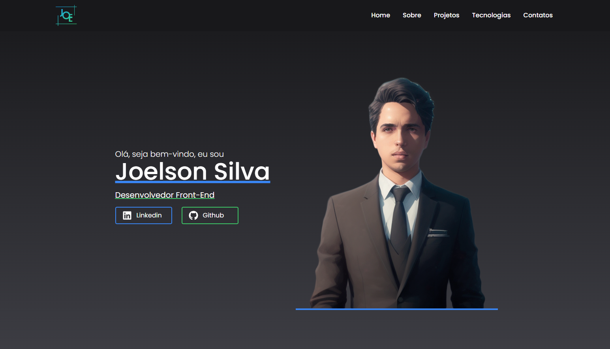
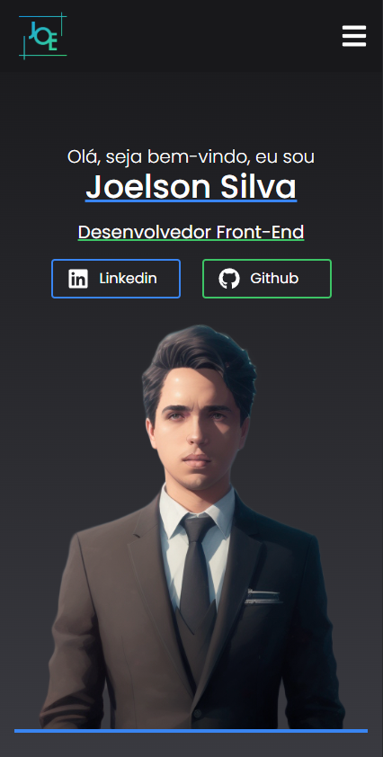

# Desktop

<p align="center">
    
  
</p>

# Mobile

<p align="center">
  
</p>

## 🧪 Technologies

Este Projeto foi desenvolvido usando seguintes tecnolias:

- [ReactJS](https://reactjs.org)
- [ViteJS](https://vitejs.dev)
- [Tailwind Css](https://tailwindcss.com)

## 🚀 Getting started

Clone o projeto pare ter acessos dos arquivos.

```bash
git clone https://github.com/JoeSeraphy/portfolio-react.git

cd portfolio
```

Run this command to install the dependencies.

```bash
npm install

npm run dev
```

## 🔖 Layout

Você pode visualiza os projetos pelos links abaixo:

- [Live Preview](https://vercel.com/joeseraphy/joelson-portfollio)

## 📝 License

This project is licensed under the MIT License. See the [LICENSE](LICENSE) file for details.

---

Made with 💜 by [JoeSeraphy]
